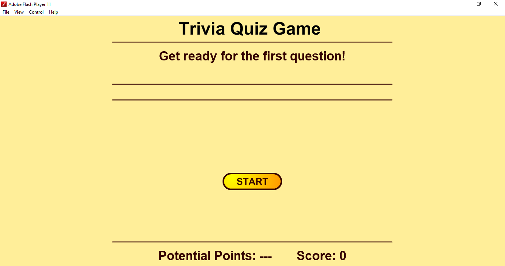
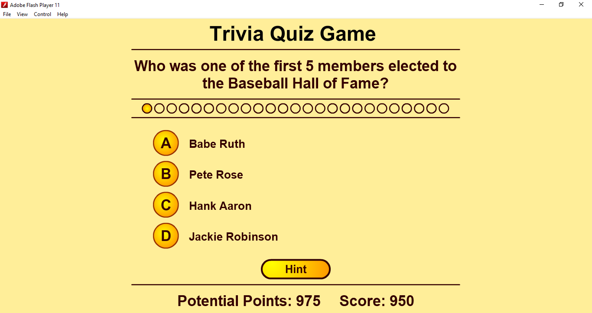

# TRIVIA QUIZ GAME

* Purpose: My Project
* Programming Language: Action Script 3.0
* IDE: Adobe Flash Professional CS6
* Target: Flash Player 9
* Type of Application: Desktop Application (Quiz Game)
  
<h2> User Interface Screenshots </h2> 
  
  
  
    